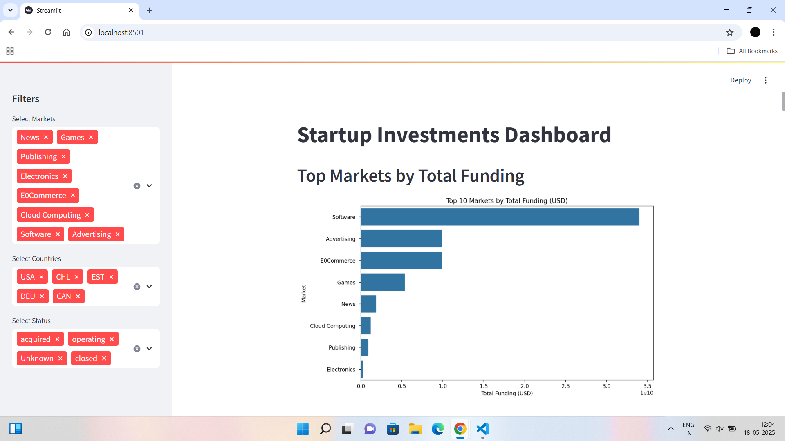
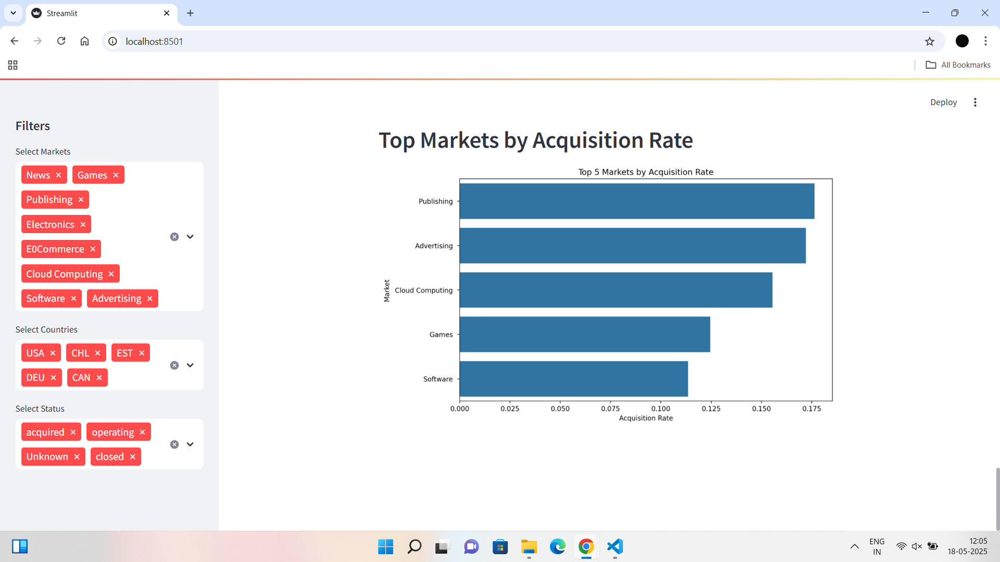

# Startup Investments Hackathon 🚀

Hey there! Welcome to my project for the Startup Investments Hackathon. I’ve analyzed a dataset of startup investments and built an interactive dashboard to share some really cool insights. Let’s dive in!

## What’s This Project About? 📊
I took a dataset from [Kaggle](https://www.kaggle.com/datasets/arindam235/startup-investments-crunchbase) and dug deep to uncover trends in startup investments. My goal was to clean the data, find meaningful insights, and create a user-friendly Streamlit dashboard where you can explore the findings yourself. I’ve deployed the app online and documented everything right here in this GitHub repo.

## What I Did (Objectives) ✅
- **Cleaned the Dataset**: I handled missing values, fixed inconsistencies, and saved the cleaned data as `cleaned_investments.csv`.
- **Analyzed the Data**: I performed exploratory data analysis (EDA) to spot trends and patterns.
- **Built a Dashboard**: I created an interactive Streamlit app with 8 visualizations and filters to explore the data.
- **Deployed the App**: I hosted the dashboard on Streamlit Cloud so anyone can check it out.
- **Documented Everything**: This repo has all my code, insights, and a detailed report.

## Cool Insights I Found 🔍
Here are the 8 key insights I discovered:
1. **Top Markets by Funding**: Biotechnology and Software are the big winners, attracting the most investment.
2. **Funding by Status**: Acquired startups tend to have higher median funding—success pays off!
3. **Top Countries**: The USA leads with the most startups, followed by the UK and China.
4. **Funding Trends Over Time**: Funding peaked around 2010-2015, likely due to a tech boom.
5. **Funding Rounds**: Startups with more funding rounds generally raise more money.
6. **Market Share**: Software and E-commerce dominate in terms of startup numbers.
7. **Funding Types**: Venture funding is the biggest contributor, followed by later-stage rounds like B and C.
8. **Acquisition Rates**: Markets like Analytics and Mobile have the highest acquisition rates—great for exits!

## Check Out the Live Dashboard 🌐
I’ve deployed the dashboard on Streamlit Cloud, and you can play with it here:  
👉 [Startup Investments Dashboard](https://amanraj74-startup-investments-analysis-app-ydcipl.streamlit.app)

It’s got filters for markets, countries, and startup status, so you can explore the data however you like!

## Screenshots 📸
Here’s a sneak peek at the dashboard:  
  


## Want to Run It Yourself? 💻
If you’d like to run the app on your own machine, it’s super easy! Just follow these steps:

1. **Clone the Repo**:
   ```bash
   git clone https://github.com/amanraj74/Startup-Investments-Analysis.git
   cd Startup-Investments-Analysis
   
