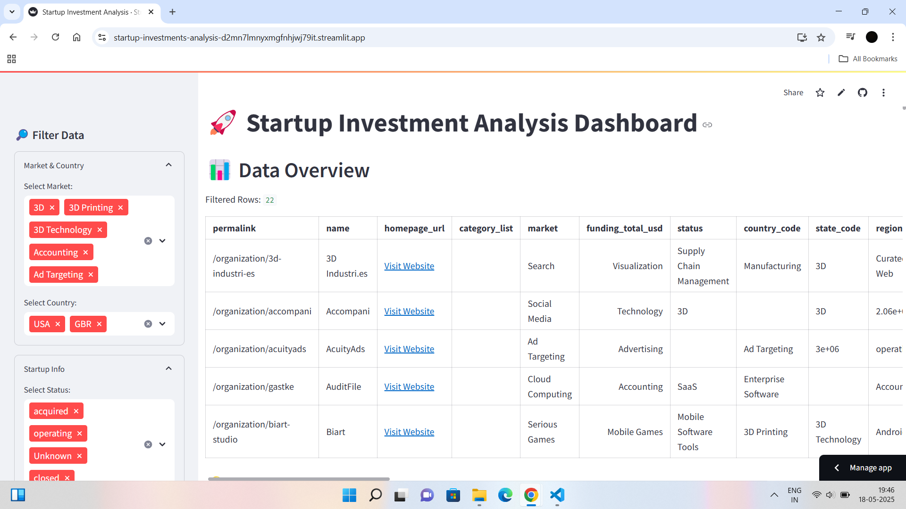
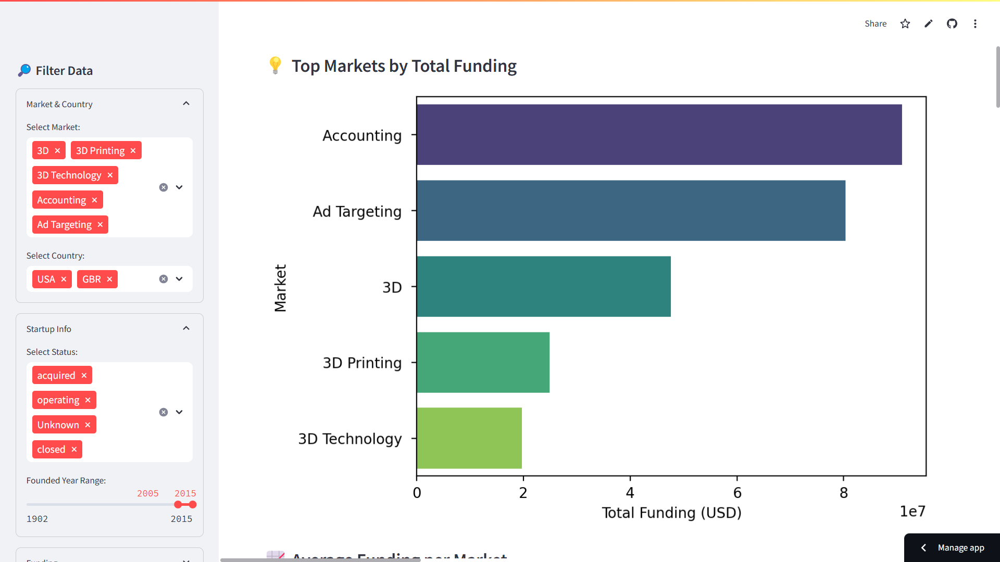

# Startup Investments Hackathon

## Project Overview
This project analyzes startup investment data to uncover key insights and presents them through an interactive Streamlit dashboard. The dataset is sourced from [Kaggle](https://www.kaggle.com/datasets/arindam235/startup-investments-crunchbase).

## Objectives
- Clean and analyze the dataset to extract meaningful insights.
- Develop an interactive Streamlit dashboard with visualizations.
- Deploy the app on Streamlit Cloud.
- Document the project in this GitHub repository.

## Key Insights
1. Top markets by total funding (e.g., Biotechnology, Software).
2. Funding distribution by startup status (operating, acquired, closed).
3. Top countries by number of startups (e.g., USA, UK).
4. Funding trends over time by founded year.
5. Relationship between funding rounds and total funding.
6. Market share by number of startups.
7. Funding breakdown by funding type (seed, venture, etc.).
8. Markets with the highest acquisition rates.

## Screenshots



## How to Run Locally
1. Clone the repository:
   ```bash
   git clone https://github.com/your-username/Startup-Investments-Hackathon.git